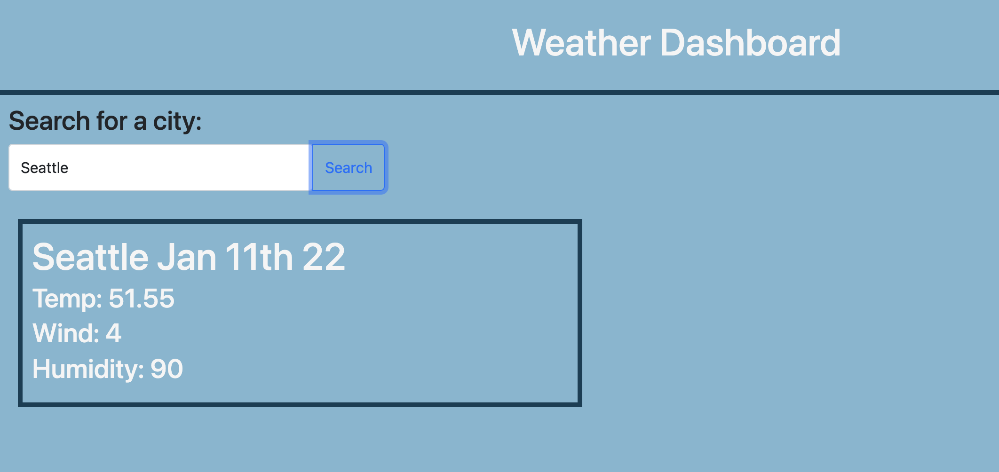

# Weather Dashboard
live site: https://425megs.github.io/weather-dashboard/ 
 
repo: https://github.com/425megs/weather-dashboard

## User Story
AS A traveler  
I WANT to see the weather outlook for multiple cities  
SO THAT I can plan a trip accordingly

## Description
With this weather dashboard, you can look up the current weather in over 200,000 cities! Simply type in the name of a city and search away. You will then see the weather data including the date, temperature, wind speeds and humidity displayed in the box below the search bar. 

## What I Learned
In this project, I worked with a third-party API for the first time. I used [OpenWeather One Call API](https://openweathermap.org/api/one-call-api) to retrieve weather data for cities and adjusted the parameters of the URL to narrow down the data I wanted on my page. I ended up using 2 APIs from OpenWeather to retrieve all the data I needed and used Moment to display the current date.

- - -
© 2021 Trilogy Education Services, LLC, a 2U, Inc. brand. Confidential and Proprietary. All Rights Reserved.
